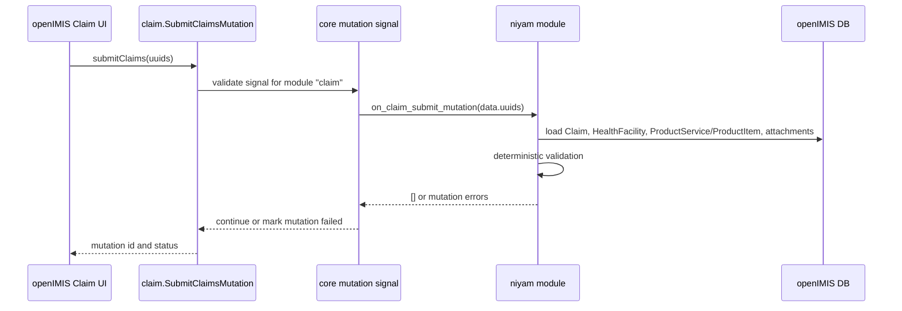

# NIYAM openIMIS Backend Integration

This module is built as a normal openIMIS backend module named `niyam`.

## Why A Separate Module

NIYAM should not patch `claim` source code directly. openIMIS already provides a module signal mechanism around GraphQL mutations. The claim module uses `SubmitClaimsMutation` with `_mutation_module = "claim"`, and core sends:

```python
signal_mutation_module_validate["claim"]
```

before the mutation changes claim state. NIYAM binds to that signal and returns mutation errors when a claim should not be submitted.

## Data Sources

NIYAM reads live openIMIS models:

| Validation need | openIMIS source |
| --- | --- |
| Claim header | `claim.models.Claim` |
| Facility code, level, care type, contract dates | `location.models.HealthFacility` through `Claim.health_facility` |
| Service lines | `claim.models.ClaimService` |
| Item/medicine lines | `claim.models.ClaimItem` |
| Benefit package membership | `product.models.ProductService` and `product.models.ProductItem` |
| Product effective dates | `product.models.Product.date_from/date_to` |
| Medical service/item care type and level | `medical.models.Service` and `medical.models.Item` |
| Referral presence | `Claim.refer_from` / `Claim.refer_to` |
| Evidence presence | `ClaimAttachment` metadata and configured attachment type aliases |

No HIB package rows are hardcoded in this module. HIB/SSF package data should be loaded into openIMIS Product, ProductService, ProductItem, Service, Item, and HealthFacility records through the normal openIMIS data-management path.

## Installation

Folder placement:

```text
Downloads/
  openimis-be_py/
  niyam_openimis/
```

Add to `openimis-be_py/openimis.json`:

```json
{
  "name": "niyam",
  "pip": "-e ../niyam_openimis"
}
```

Install and migrate:

```bash
cd /Users/shuv/Downloads/openimis-be_py
pip install -e ../niyam_openimis
cd openIMIS
python manage.py migrate niyam
```

If you are already inside `openimis-be_py/openIMIS`, the editable install path is `../../niyam_openimis`.

## Runtime Flow



## GraphQL Surface

Manual validation query:

```graphql
query {
  niyamValidateClaim(claimUuid: "CLAIM-UUID") {
    claimUuid
    claimCode
    decision
    decisions {
      decision
      reasonCode
      correctionPath
      lineCode
      trace {
        sequence
        check
        status
        evidence
      }
    }
  }
}
```

Manual validation mutation:

```graphql
mutation {
  validateNiyamClaim(input: { claimUuid: "CLAIM-UUID" }) {
    validation {
      decision
      decisions {
        reasonCode
        correctionPath
      }
    }
  }
}
```

## Configuration

The module reads `ModuleConfiguration` for `niyam`. Defaults are defined in `niyam/apps.py`.

Important settings:

| Setting | Default | Meaning |
| --- | --- | --- |
| `block_submit_on_block` | `true` | Return mutation errors for `BLOCK` decisions. |
| `warn_submit_on_warn` | `false` | Allow submit on `WARN` by default, while logging the warning. |
| `required_attachment_types` | aliases for referral, prescription, bill, discharge, diagnostic | Maps openIMIS attachment labels/filenames/types to evidence categories. |

## Production Notes

- Load real HIB and SSF package facts into openIMIS Product and ProductService/ProductItem tables; NIYAM will evaluate against those records.
- Use HealthFacility level and care type consistently. NIYAM does not invent tier mappings if deployment data is incomplete; it warns when a level relationship is ambiguous.
- Keep the audit log. `niyam_validation_log` stores the decision, reason, correction path, line code, product code, and trace used at submission time.
- Treat this as pre-submission validation. openIMIS remains the source of truth for claim status, adjudication, valuation, and payment.
